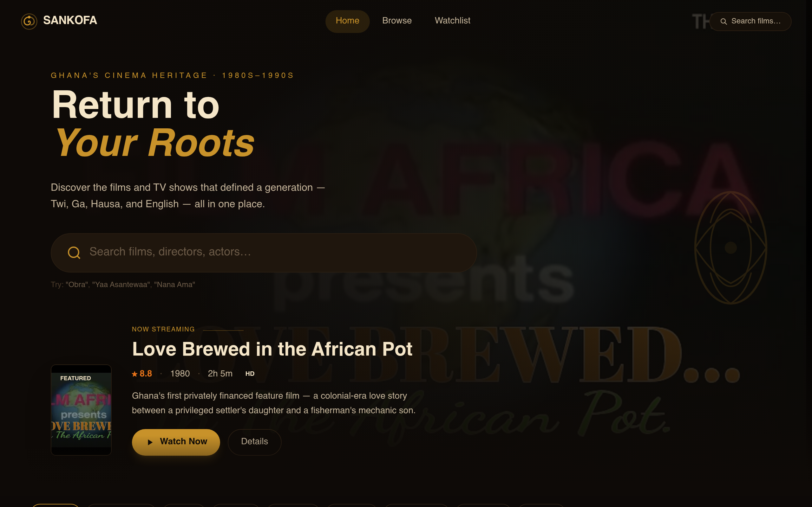
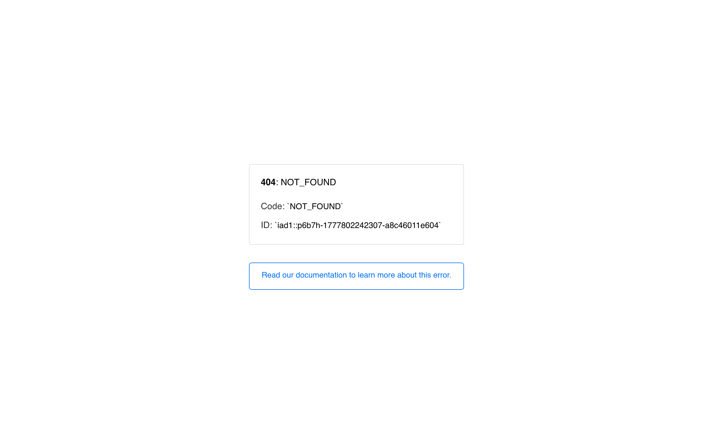

# SANKOFA — Ghana's Cinematic Heritage

> *"Se wo were fi na wosankofa a yenkyi"* — It is not wrong to go back for what you forgot.

A streaming archive dedicated to preserving and celebrating Ghanaian cinema from the 1980s–1990s. Discover the films, TV serials, and documentaries that defined a generation.

**[→ Live Demo](https://sankofa-six.vercel.app)**



---

## Features

- **20 titles** spanning films, TV series, and documentaries
- **Full-text search** across titles, directors, cast, and synopsis
- **Filter by** genre, language, decade, type, and region
- **YouTube thumbnails** sourced from original footage
- **Film detail pages** with cast, synopsis, and related titles
- **Watchlist** (coming soon)
- Responsive design — works on mobile, tablet, and desktop

## Browse Page



## Tech Stack

| Tool | Version |
|------|---------|
| [Vite](https://vitejs.dev) | 6 |
| [React](https://react.dev) | 18 |
| [React Router](https://reactrouter.com) | 6 |
| [Tailwind CSS](https://tailwindcss.com) | 3 |
| [Vercel](https://vercel.com) | — |

## Getting Started

```bash
# Clone the repo
git clone https://github.com/kamensgh/sankofa.git
cd sankofa

# Install dependencies (requires Node 20+)
npm install

# Start dev server
npm run dev

# Build for production
npm run build
```

> **Note:** Requires Node 20. If you use nvm: `nvm use 20`

## Project Structure

```
src/
├── components/
│   ├── HeroBanner.jsx     # Full-screen hero with featured film
│   ├── MovieCard.jsx      # Film card with hover actions
│   ├── MovieRow.jsx       # Horizontally scrollable film row
│   ├── Navbar.jsx         # Fixed top nav with scroll transition
│   ├── SankofaLogo.jsx    # SVG logo component
│   └── SearchBar.jsx      # Global search input
├── data/
│   └── movies.js          # All 20 films with metadata
└── pages/
    ├── HomePage.jsx        # Hero + categorised film rows
    ├── MovieDetailPage.jsx # Individual film page
    ├── SearchPage.jsx      # Filter + search with drawer sidebar
    └── WatchlistPage.jsx   # Watchlist (coming soon)
```

## Films in the Archive

| Title | Year | Type | Rating |
|-------|------|------|--------|
| Love Brewed in the African Pot | 1980 | Film | ★ 8.8 |
| By the Fireside | 1985 | TV Series | ★ 9.0 |
| Osofo Dadzie | 1972 | TV Series | ★ 9.2 |
| Heritage Africa | 1989 | Film | ★ 9.1 |
| Obra | 1982 | TV Series | ★ 9.4 |
| Kukurantumi: Road to Accra | 1983 | Film | ★ 8.5 |
| Efiewura | 1998 | TV Series | ★ 8.8 |
| Beyoncé & Rihanna | 2006 | Film | ★ 8.3 |
| Things We Do for Love | 1998 | TV Series | ★ 8.1 |
| Taxi Driver | 1998 | TV Series | ★ 8.8 |
| *…and 10 more* | | | |

## Design

The design system draws from Ghanaian visual culture:

- **Kente border** — the gold/orange stripe running across the top of the site
- **Adinkra motifs** — SVG symbols used as decorative elements
- **Colour palette** — deep brown-blacks (`#0E0A07`), aged gold (`#C8922A`), warm cream (`#F5E6C8`)
- **Typography** — Playfair Display (display) + Libre Baskerville (body)

## License

MIT — free to use, fork, and build upon.

---

Built with ♥ for Ghanaian cinema.
